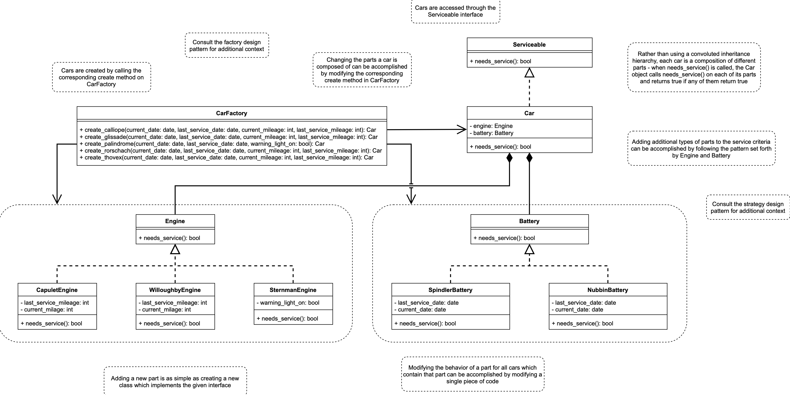

# 

# task 1: software architecture

# task 2: refactoring

# task 3: unit test

# task 4: test-driven development

### a. upgrade spindler batteries
First, modify the Spindler battery so it requires service after three years instead of two. Notice how easy it is to make this change - you only need to touch one line of code instead of several, and the place where that line of code lives is immediately obvious. Consider what steps would have been required to make this change to the original system architecture, and how much more difficult it would have been, especially if you were new to working on the codebase.

### b. add tire servicing criteria
There are two types of tires currently in use by the Lyft fleet - Carrigan tires and Octoprime tires. The new tire wear sensors produce an array of four numbers between 0 and 1 inclusive, representing how worn each of the tires are. This array will be passed to each function in the car factory class, to be used by your tire implementation. Carrigan tires should be serviced only when one or more of the values in the tire wear array is greater than or equal to 0.9. Octoprime tires should be serviced only when the sum of all values in the tire wear array is greater than or equal to 3. 

